# Detecting and Automatically Remediating EBS Security Misconfigurations

> Security misconfigurations are easier to fix when detection and remediation happen automatically.

## Project Overview

This project demonstrates an automated AWS security compliance workflow using **AWS Config, Amazon EventBridge, Amazon CloudWatch Logs, Amazon SNS, and AWS Systems Manager Automation**.

The goal is to detect when **EBS encryption by default** is disabled, generate a compliance event, notify the security team, and automatically remediate the configuration.

The project follows a security workflow:

**Detect → Notify → Remediate → Verify**

The environment is intentionally configured with a non-compliant security state during testing so the complete detection and remediation workflow can be validated.

---

## Security Scenario

A company requires **EBS encryption by default** to be enabled in its AWS Region.  
A security control is implemented to detect violations of this requirement.

### Expected Security State

```text
EBS Encryption by Default
        ↓
      ENABLED
        ↓
    COMPLIANT
```

### Simulated Violation

During testing, EBS encryption by default is intentionally disabled:

```text
EBS Encryption by Default
        ↓
     DISABLED
        ↓
   NON_COMPLIANT
```

AWS Config detects the violation and triggers the automated security workflow.

---

## Architecture

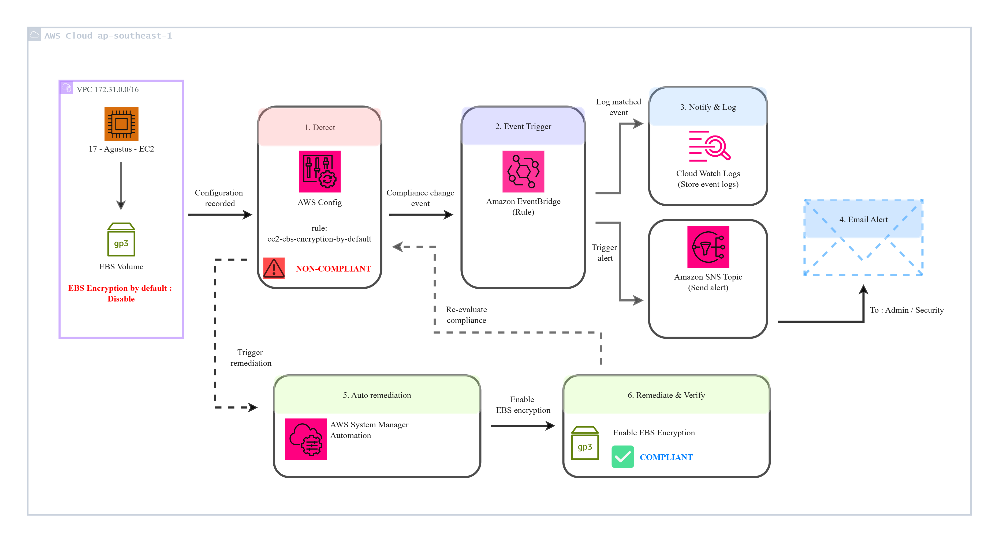


---

## Security Workflow

### 1. Detect

AWS Config evaluates the EBS encryption configuration using the managed rule:

```text
ec2-ebs-encryption-by-default
```

When encryption by default is disabled, the rule reports:

```text
NON_COMPLIANT
```

### 2. Event Trigger

The compliance change generates an AWS Config compliance event.

Amazon EventBridge filters for the specific rule and `NON_COMPLIANT` state.

### 3. Notify & Log

The EventBridge rule sends the matched event to:

* **CloudWatch Logs** for event evidence and troubleshooting.
* **Amazon SNS** for security notification delivery.

### 4. Email Alert

```text
SNS sending notification to the subscriber (via email)
```

### 5. Automated Remediation

AWS Config automatic remediation invokes the Systems Manager Automation runbook:

```text
AWSConfigRemediation-EnableEbsEncryptionByDefault
```

The automation enables EBS encryption by default in the current Region.

### 6. Verify

AWS Config evaluates the configuration again.

Expected final state:

```text
EBS Encryption by Default = Enabled
Compliance Status = COMPLIANT
```

---

## AWS Services Used

| Service                        | Purpose                                                |
| ------------------------------ | ------------------------------------------------------ |
| AWS Config                     | Detect configuration non-compliance                    |
| Amazon EventBridge             | Route compliance change events                         |
| Amazon CloudWatch Logs         | Store event evidence                                   |
| Amazon SNS                     | Deliver security notifications                         |
| AWS Systems Manager Automation | Automatically remediate the violation                  |
| Amazon EC2 / EBS               | Test environment and security configuration            |
| AWS IAM                        | Control permissions for EventBridge and SSM Automation |

---

## Testing Strategy

The workflow was tested by intentionally changing the EBS encryption-by-default configuration.

### Test Case 1 — Non-Compliant Detection

```text
Encryption by Default
        ↓
Disabled
        ↓
AWS Config
        ↓
NON_COMPLIANT
```

Expected results:

* Config reports `NON_COMPLIANT`.
* EventBridge receives the compliance change event.
* CloudWatch Logs records the event.
* SNS sends an email alert.
* Automatic remediation is triggered.

### Test Case 2 — Automated Remediation

```text
NON_COMPLIANT
      ↓
SSM Automation
      ↓
Enable EBS Encryption
      ↓
COMPLIANT
```

The encryption setting was restored automatically without manually enabling it after the violation was detected.

### Test Case 3 — Troubleshooting

A temporary explicit `Deny` was added to the EventBridge-to-SNS IAM policy.

Expected behavior:

```text
AWS Config          ✅
Auto Remediation    ✅
EventBridge         ✅
CloudWatch Logs     ✅
SNS Notification    ❌
```

This confirmed that the notification failure was isolated to the **EventBridge → SNS authorization path**.

The deny statement was removed afterward and the original least-privilege `sns:Publish` permission was restored.

---

> ## Phase 1 — Environment & Security Scenario
### Objective
Establish the AWS environment and define the security baseline that will be monitored and remediated by AWS Config.

### Security Scenario
A security policy requires **EBS encryption by default** to be enabled in the AWS Region.

For this project, the initial environment **intentionally** starts in a non-compliant state so the complete detection, notification, remediation, and verification workflow can be tested.

### Environment

| Component                 | Configuration                |
| ------------------------- | ---------------------------- |
| AWS Region                | `Asia Pacific (Singapore)`   |
| Test Resource             | Amazon EC2 instance          |
| EBS Volume                | Attached to the EC2 instance |
| EBS Encryption by Default | **Disabled** initially       |
| Default Encryption Key    | `alias/aws/ebs`              |

### Initial State

The EC2 instance used for testing had an attached EBS volume with encryption disabled.

```text id="y8f1bm"
AWS Region
    ↓
EBS Encryption by Default
    ↓
DISABLED
```

The account-level **EBS Encryption by Default** setting was verified from:

**EC2 → Settings → Data protection and security → EBS encryption**

### Expected Compliance State

```text id="x8pk3f"
Enabled
   ↓
COMPLIANT ✅
```

### Expected Non-Compliant State

```text id="6n1h4f"
Disabled
   ↓
NON_COMPLIANT ❌
```

### Why This Scenario?

EBS encryption helps protect data stored on EBS volumes. Enabling encryption by default ensures that newly created EBS volumes and snapshot copies in the Region are encrypted automatically.

For this project, the **account/Region-level EBS encryption-by-default setting** is the actual configuration evaluated by the AWS Config rule.

---
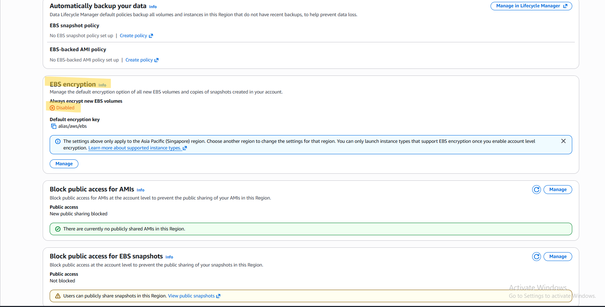

### Phase 1 Outcome

The initial environment was confirmed to have:

* A test EC2 instance with an attached EBS volume.
* EBS encryption by default disabled.
* A clearly defined security requirement.
* A known initial state suitable for AWS Config compliance testing.

This established the baseline for **Phase 2 — AWS Config Setup**.

> ## Phase 2 — AWS Config Setup

### Objective

Configure AWS Config to record AWS resource configuration and create a compliance rule that detects whether **EBS encryption by default** is enabled.

---

### Step 1 — Verify Configuration Recorder

Open:

**AWS Config → Settings**

Under **Customer managed recorder**, verify that the configuration recorder is already active.

Configuration observed:

| Setting             | Value                                                 |
| ------------------- | ----------------------------------------------------- |
| Recorder            | Customer managed recorder                             |
| Recording Status    | Recording is ON                                       |
| Recording Strategy  | Record all resource types with customizable overrides |
| Recording Frequency | Continuous                                            |
| IAM Role            | `AWSServiceRoleForConfig`                             |

The existing recorder configuration was retained because it was already active and sufficient for this project.

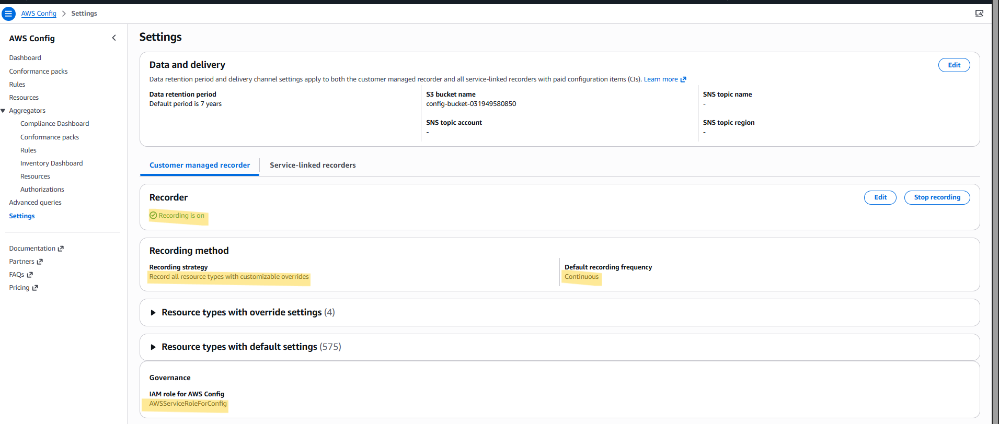
---

### Step 2 — Navigate to Config Rules

Open:

**AWS Config → Rules**

Click:

**Add rule**

Search for the AWS managed rule:

```text
ec2-ebs-encryption-by-default
```

Select the rule.

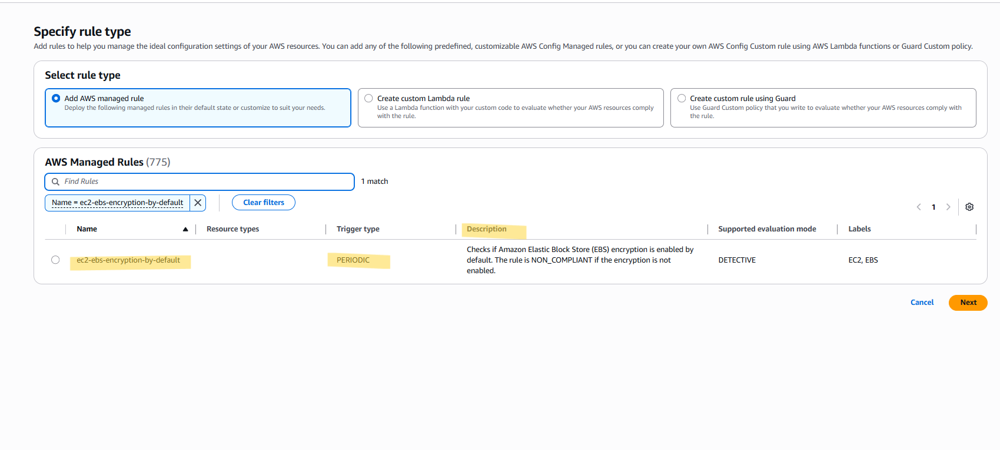
This screenshot establishes **what security control we are deploying**.

---

### Step 3 — Configure Evaluation Frequency

Configure the rule with the following settings:

| Setting         | Value     |
| --------------- | --------- |
| Evaluation Mode | Detective |
| Trigger Type    | Periodic  |
| Frequency       | 1 hours  |
| Parameters      | None      |

The rule uses periodic evaluation because the security requirement is being checked as a compliance baseline rather than evaluated in real time.

No additional parameters were required for this managed rule.

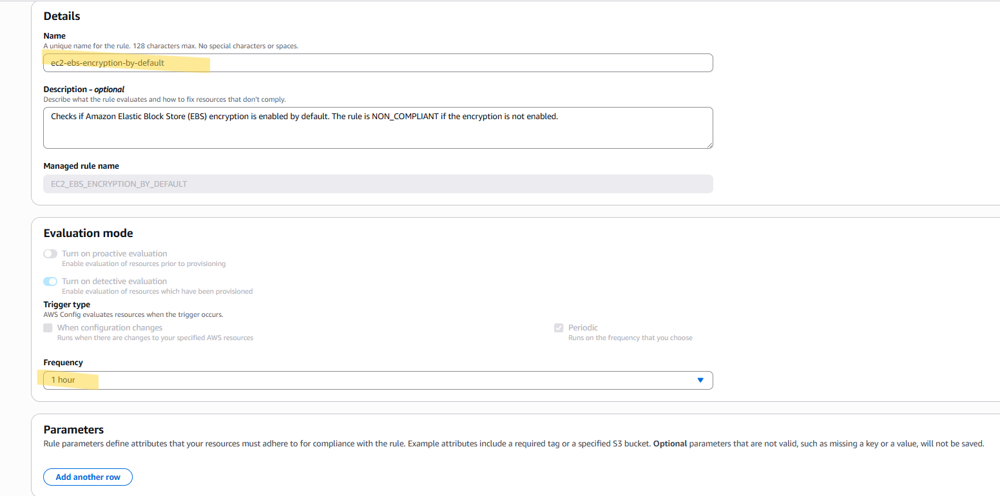

---

### Step 4 — Review and Create the Rule

Before creating the rule, review the configuration:

```text
Rule:
ec2-ebs-encryption-by-default

Evaluation:
Detective

Trigger:
Periodic

Frequency:
24 hours

Parameters:
None
```

Click:

**Save**

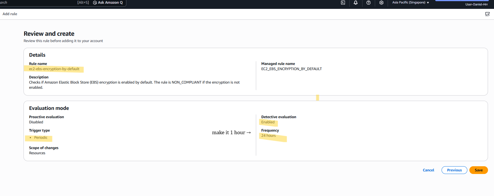

---

### Step 5 — Verify Initial Compliance Result

After the rule was created, AWS Config immediately evaluated the existing configuration.

The dashboard showed:

```text
Noncompliant Rules: 1
Noncompliant Resources: 1
```

The rule:

```text
ec2-ebs-encryption-by-default
```

was reported as:

```text
NON_COMPLIANT
```

because EBS encryption by default was still disabled.

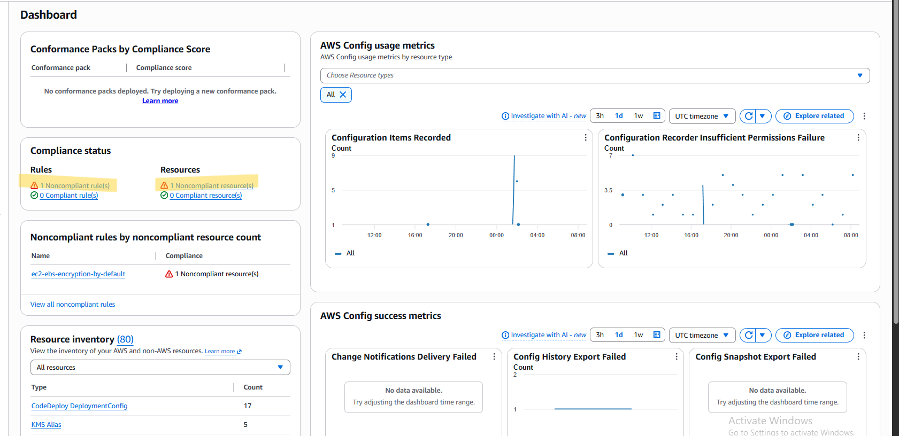
---

### Step 6 — Inspect the Non-Compliant Resource

Open the rule and inspect the non-compliant resource.

AWS Config identified the resource as:

```text
Resource Type:
AWS Account

Compliance:
Noncompliant

Annotation:
EBS Encryption by default is not enabled.
```

This confirms that the rule is evaluating the **account/Region EBS encryption-by-default setting**, rather than simply checking whether one specific EBS volume is encrypted.

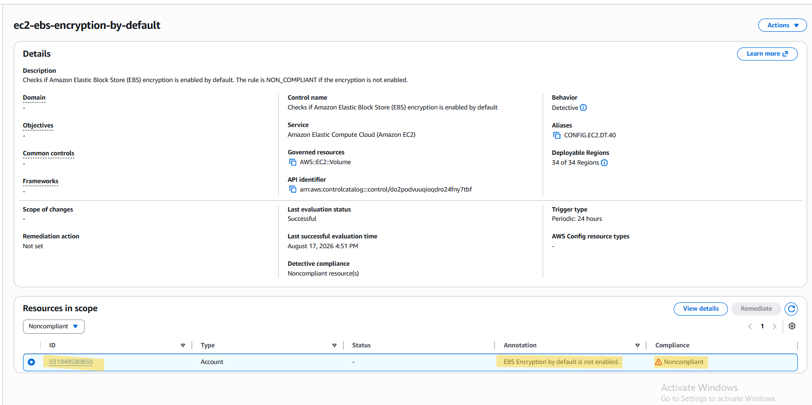
---

## Phase 2 Result

The detection layer is now working:

```text
AWS Config Recorder
        ↓
Configuration Data
        ↓
Config Rule
        ↓
NON_COMPLIANT ❌
```

At the end of Phase 2, AWS Config successfully detected that **EBS encryption by default was disabled**.

This `NON_COMPLIANT` state becomes the input for **Phase 4 — EventBridge Integration** after the state-change testing in Phase 3.

> ## Phase 3 — Security Violation & State Change

### Objective

Change the EBS encryption security configuration from a `non-compliant` state to a `compliant` state and verify that AWS Config detects the change.

---

### Step 1 — Enable EBS Encryption by Default

Open:

**EC2 → Settings → EBS encryption**

Change the setting to:

```text
Always encrypt new EBS volumes
        ↓
      Enabled
```

The default encryption key remained:

```text
alias/aws/ebs
```

This changes the account/Region security configuration to the required baseline.

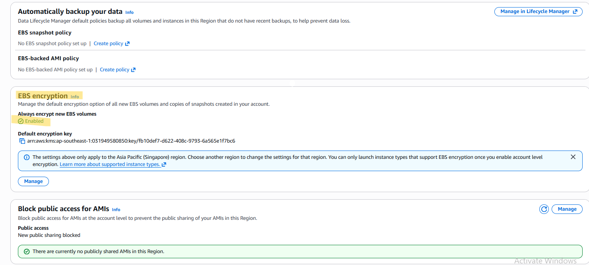
---

### Step 2 — Check AWS Config Compliance Status

After enabling encryption, AWS Config may still display the previous evaluation result because the rule uses **periodic evaluation** (1 hour).

The rule initially remained:

```text
NON_COMPLIANT
```

even though the EBS encryption setting had already been changed to `Enabled`.

This demonstrates that the compliance status does not necessarily update immediately after a configuration change.

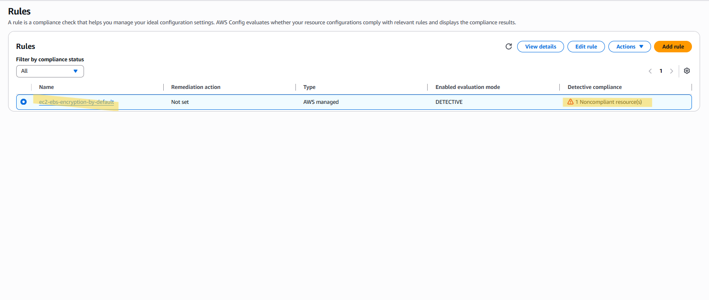

---

### Step 3 — Trigger Manual Re-Evaluation

Instead of waiting for the 24-hour periodic evaluation interval, manually trigger a new evaluation.

Open:

**AWS Config → Rules**

Select:

`ec2-ebs-encryption-by-default`

Then:

**Actions → Re-evaluate**

This forces AWS Config to evaluate the current configuration immediately.

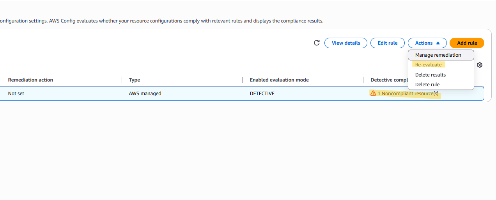
---

### Step 4 — Verify Compliance State

After the manual evaluation completes, refresh the rule status.

The result changed to:

```text
EBS Encryption by Default
        ↓
      Enabled
        ↓
      COMPLIANT ✅
```

The AWS Config dashboard showed:

* `0 Noncompliant rules`
* `1 Compliant rule`
* `0 Noncompliant resources`

This confirms that AWS Config recognized the new secure configuration.

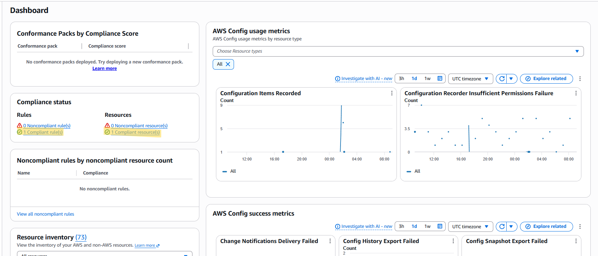
---

## Phase 3 Result

The configuration successfully transitioned from:

```text
NON_COMPLIANT ❌
        ↓
Enable EBS Encryption
        ↓
Manual Re-Evaluation
        ↓
COMPLIANT ✅
```

This phase demonstrated that:

* A configuration change does not necessarily produce an immediate compliance result when using periodic evaluation.
* AWS Config can be manually re-evaluated when immediate validation is required.
* The security baseline was successfully restored.

The environment was now in a **COMPLIANT** state and ready for the event-driven integration implemented in the following phases.

> ## Phase 4 — EventBridge Integration

### Objective

Connect AWS Config compliance events to Amazon EventBridge and route `NON_COMPLIANT` events to CloudWatch Logs for monitoring and troubleshooting.

The goal of this phase is to establish the **event routing layer** of the security workflow.

---

## Step 1 — Create an EventBridge Rule

Open:

**Amazon EventBridge → Rules → Create rule**

Create the rule with:

```text id="b0d7f3"
Name:
config-noncompliant-ebs

Event Bus:
default

Rule State:
Enabled
```

The rule is designed to detect compliance changes generated by AWS Config.

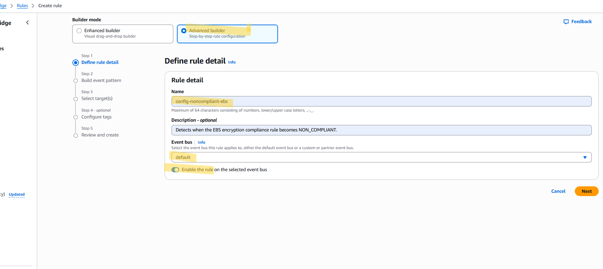
---

## Step 2 — Use Advanced Event Pattern

For the event pattern, select:

**Event source → AWS services**

Then select:

**Creation method → Custom pattern (JSON editor)**

The EventBridge rule uses a custom JSON event pattern to filter only the AWS Config event we are interested in.

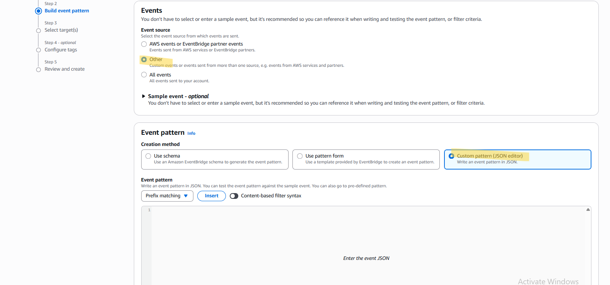
---

## Step 3 — Define the Event Pattern

The event pattern was configured to match:

* AWS Config events
* Compliance change notifications
* The specific rule `ec2-ebs-encryption-by-default`
* Compliance state `NON_COMPLIANT`

```json id="g78b6c"
{
  "source": ["aws.config"],
  "detail-type": ["Config Rules Compliance Change"],
  "detail": {
    "messageType": ["ComplianceChangeNotification"],
    "configRuleName": ["ec2-ebs-encryption-by-default"],
    "newEvaluationResult": {
      "complianceType": ["NON_COMPLIANT"]
    }
  }
}
```

This prevents the rule from reacting to unrelated AWS Config events.

In simplified form:

```text id="76txmc"
AWS Config
     ↓
Compliance Change Event
     ↓
Rule:
ec2-ebs-encryption-by-default
     ↓
NON_COMPLIANT
```
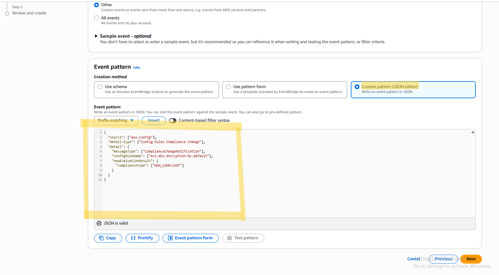
---

## Step 4 — Configure CloudWatch Logs as Target

For the EventBridge target, select:

**Target type → AWS service**

Then configure:

**Target → CloudWatch Log Group**

Create a new Log Group:

```text id="f0k9p2"
/aws/events/config-noncompliant
```

The CloudWatch Log Group is used to capture the matched EventBridge event.

This gives us an evidence trail that can be inspected during testing and troubleshooting.

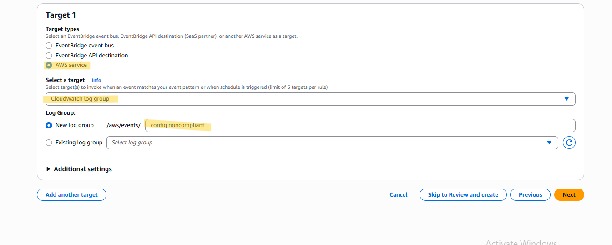
---

## Step 5 — Complete the EventBridge Rule

Review the configuration:

```text id="u0xv3d"
Event Source:
AWS Config

Event Pattern:
NON_COMPLIANT
ec2-ebs-encryption-by-default

Target:
CloudWatch Log Group
/aws/events/config-noncompliant
```

Create the EventBridge rule.

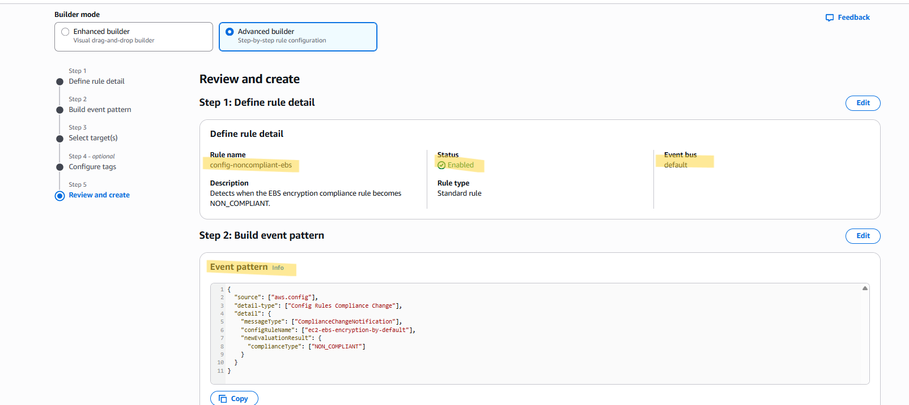
---

## Step 6 — Simulate a Non-Compliant State

To test the event-driven workflow, temporarily disable:

**EC2 → Settings → EBS encryption**

Set:

```text id="s6cr9a"
Always encrypt new EBS volumes
        ↓
      Disabled
```

This intentionally recreates the security violation.  
This is the trigger condition for the test.


---

## Step 7 — Re-Evaluate AWS Config

Return to:

**AWS Config → Rules → `ec2-ebs-encryption-by-default`**

Select:

**Actions → Re-evaluate**

AWS Config evaluates the changed configuration and reports:

```text id="8el6qb"
NON_COMPLIANT ❌
```

This compliance change generates an AWS Config event.


---

## Step 8 — Verify EventBridge Delivery

Open:

**CloudWatch → Log groups**

Select:

```text id="o7plw9"
/aws/events/config-noncompliant
```

A new log event should appear.

The event contained values including:

```text id="u2a4lw"
source:
aws.config

detail-type:
Config Rules Compliance Change

configRuleName:
ec2-ebs-encryption-by-default

complianceType:
NON_COMPLIANT
```

This proves that the EventBridge event pattern successfully matched the AWS Config event and delivered it to the CloudWatch Log Group.

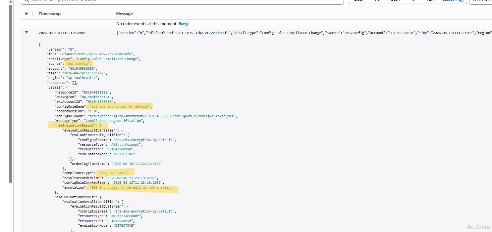
---

## Phase 4 Result

The event-driven detection path was successfully validated:

```text id="u0om6f"
AWS Config
      ↓
NON_COMPLIANT
      ↓
Compliance Change Event
      ↓
EventBridge
      ↓
Event Pattern Match
      ↓
CloudWatch Logs
```

The EventBridge rule successfully detected the targeted AWS Config compliance event and stored the event payload in CloudWatch Logs.

This established the foundation for the next phase:

**EventBridge → SNS → Email Notification**

> ## Phase 5 — SNS Notification

### Objective

Configure Amazon SNS to receive compliance events from Amazon EventBridge and deliver security notifications through email.

The goal of this phase is to extend the workflow from:

```text
AWS Config → EventBridge
```

into:

```text
AWS Config
    ↓
EventBridge
    ↓
SNS
    ↓
Email Alert
```

---

## Step 1 — Create an SNS Topic

Open:

**Amazon SNS → Topics → Create topic**

Create a **Standard** topic with the name:

```text id="f06p8c"
cloud-security-alerts
```

The topic acts as the notification destination for security compliance events.

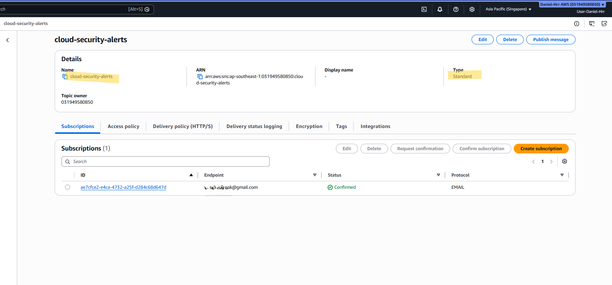
---

## Step 2 — Create an Email Subscription

Open the topic:

```text id="vy0k3m"
cloud-security-alerts
```

Create a subscription with:

| Setting  | Value                       |
| -------- | --------------------------- |
| Protocol | Email                       |
| Endpoint | Security notification email |

SNS sends a confirmation request to the email address.  
The subscription must be confirmed before SNS can deliver notifications.

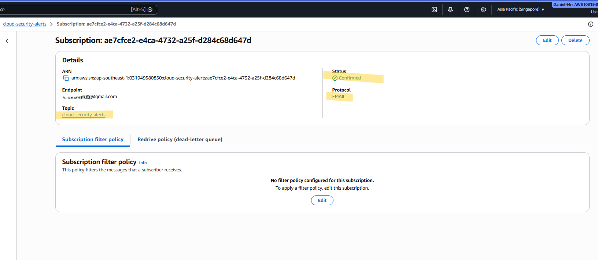
---

## Step 3 — Configure SNS as an EventBridge Target

Return to:

**Amazon EventBridge → Rules → `config-noncompliant-ebs`**

Edit the existing rule and add a second target.

Keep the existing CloudWatch Logs target.

The resulting architecture becomes:

```text id="6a2xj1"
EventBridge
    ├──→ CloudWatch Logs
    │
    └──→ SNS
```

For the new target, select:

**Target type → AWS service**

Then select:

**SNS topic**

Choose:

```text id="0s6j8w"
cloud-security-alerts
```

---

## Step 4 — Configure the EventBridge Execution Role

The EventBridge rule uses a dedicated IAM role for publishing to the SNS topic.

The role created for this integration was:

```text id="r6dk1k"
Sns-topic-for-eventbridge
```

### Trust Relationship

The role trusts EventBridge:

```json id="q1x2s8"
{
  "Version": "2012-10-17",
  "Statement": [
    {
      "Sid": "EventBridgeAssumeRole",
      "Effect": "Allow",
      "Principal": {
        "Service": "events.amazonaws.com"
      },
      "Action": "sts:AssumeRole"
    }
  ]
}
```

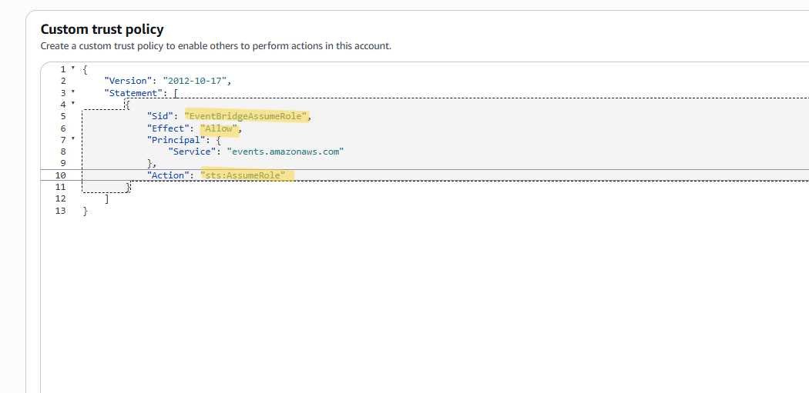
### Permission Policy

The role was given only the permission required to publish to the specific SNS topic:

```json id="s3b9nd"
{
  "Version": "2012-10-17",
  "Statement": [
    {
      "Sid": "AllowSnsPublish",
      "Effect": "Allow",
      "Action": "sns:Publish",
      "Resource": "arn:aws:sns:ap-southeast-1:031949580850:cloud-security-alerts"
    }
  ]
}
```

This follows a **least-privilege approach** by limiting the role to `sns:Publish` on a single SNS topic.

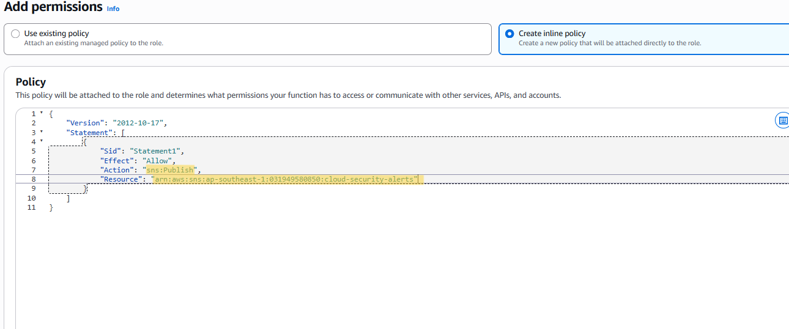
---

## Step 5 — Verify the EventBridge Rule Targets

After updating the rule, verify that it contains both targets:

```text id="t04o5c"
Target 1:
CloudWatch Log Group
/aws/events/config-noncompliant

Target 2:
SNS
cloud-security-alerts
```

This provides both:

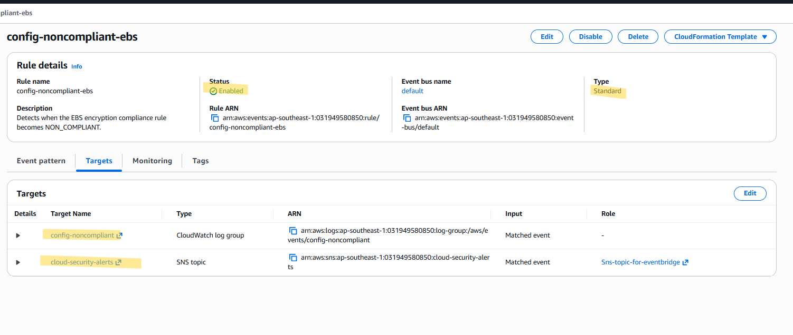

---

## Step 6 — Simulate a Non-Compliant Configuration

For testing, temporarily disable:

**EC2 → Settings → EBS encryption**

Set:

```text id="5vfp5m"
Always encrypt new EBS volumes
        ↓
      Disabled
```

This intentionally creates the security violation required to generate an alert.  
The EBS encryption-by-default setting as `Disabled`.

---

## Step 7 — Trigger AWS Config Evaluation

Return to:

**AWS Config → Rules → `ec2-ebs-encryption-by-default`**

Select:

**Actions → Re-evaluate**

AWS Config should report:

```text id="2z4w7r"
NON_COMPLIANT ❌
```

The compliance change generates the EventBridge event that matches the rule pattern.


---

## Step 8 — Verify SNS Email Notification

After the EventBridge event is processed, SNS publishes the notification to the confirmed email subscription.

The email should contain information related to the AWS Config compliance event, including values such as:

```text id="3xj4pf"
configRuleName:
ec2-ebs-encryption-by-default

complianceType:
NON_COMPLIANT
```

This proves the notification path is working:

```text id="i1y3v4"
NON_COMPLIANT
      ↓
AWS Config
      ↓
EventBridge
      ↓
SNS
      ↓
Email Alert ✅
```

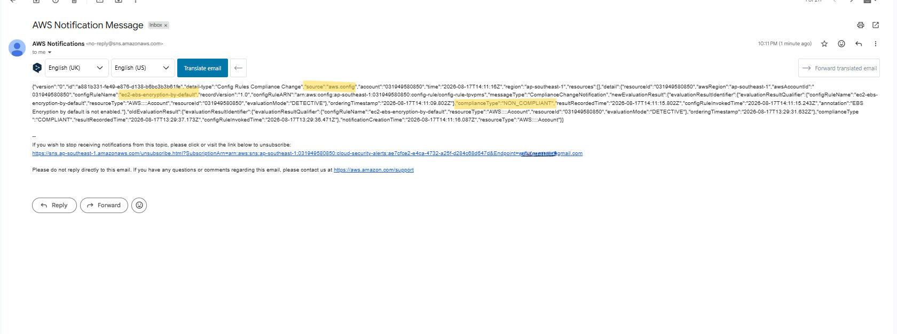
---

## Step 9 — Restore the Secure State

After confirming the notification, restore:

```text id="9dmtv9"
Always encrypt new EBS volumes
        ↓
      Enabled
```

Then return to AWS Config and perform:

**Actions → Re-evaluate**

The expected final state is:

```text id="y1e2x7"
EBS Encryption by Default
        ↓
      Enabled
        ↓
      COMPLIANT ✅
```

This ensures the environment does not remain in the intentionally insecure test state.

---

## Phase 5 Result

The notification workflow was successfully implemented and tested:

```text id="w6m9gq"
AWS Config
      ↓
NON_COMPLIANT
      ↓
EventBridge
   ↙       ↘
Logs       SNS
            ↓
          Email ✅
```

The existing CloudWatch Logs target was retained for security evidence and troubleshooting, while SNS was added as the notification mechanism.

The environment was then restored to:

```text id="j4z0qk"
EBS Encryption by Default = Enabled
AWS Config = COMPLIANT
```

This completed the **security notification layer** of the project.

> ## Phase 6 — Automated Response & Remediation

### Objective

Configure AWS Config to automatically remediate an EBS encryption compliance violation using **AWS Systems Manager Automation**.

The objective is to eliminate the need for manual remediation after AWS Config detects a `NON_COMPLIANT` configuration.

The workflow becomes:

```text id="2qk8x1"
NON_COMPLIANT
      ↓
AWS Config
      ↓
Automatic Remediation
      ↓
SSM Automation
      ↓
Enable EBS Encryption
      ↓
COMPLIANT
```

---

## Step 1 — Open Config Remediation Settings

Open:

**AWS Config → Rules**

Select:

```text
ec2-ebs-encryption-by-default
```

Then:

**Actions → Manage remediation**

Select:

**Automatic remediation**

This allows AWS Config to automatically initiate a remediation action when the rule detects a non-compliant state.

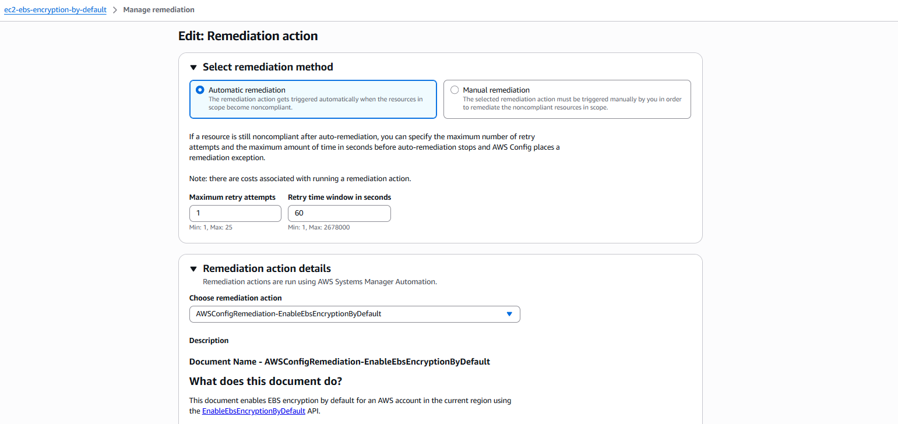
---

## Step 2 — Select the Remediation Runbook

Use the AWS Systems Manager Automation runbook:

```text id="9y7m3p"
AWSConfigRemediation-EnableEbsEncryptionByDefault
```

This runbook is designed to enable EBS encryption by default and verify the resulting configuration.

The runbook is executed when AWS Config detects the rule as `NON_COMPLIANT`.

---

## Step 3 — Configure Remediation Controls

The following remediation settings were configured:

| Setting                    | Value        |
| -------------------------- | ------------ |
| Remediation Mode           | Automatic    |
| Maximum Automatic Attempts | `1`          |
| Retry Time Window          | `60 seconds` |
| Concurrent Execution Rate  | `1`          |
| Error Rate                 | `1`          |
| Resource ID Parameter      | `n/a`        |

The `Resource ID` parameter was set to `n/a` because this rule evaluates the **account/Region-level EBS encryption-by-default setting**, rather than an individual EC2 or EBS resource.

The remediation action requires an `AutomationAssumeRole`.

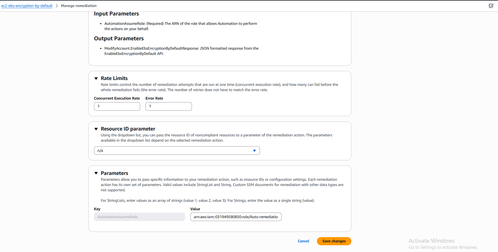
---

## Step 4 — Create the SSM Automation IAM Role

A dedicated IAM role was created for Systems Manager Automation:

```text id="7k5n1m"
Auto-remediation-role
```

The role uses a custom trust policy allowing Systems Manager to assume it.

### Trust Policy

```json id="q8t2jf"
{
  "Version": "2012-10-17",
  "Statement": [
    {
      "Sid": "SSMAutomationAssumeRole",
      "Effect": "Allow",
      "Principal": {
        "Service": "ssm.amazonaws.com"
      },
      "Action": "sts:AssumeRole"
    }
  ]
}
```

This establishes the trust relationship:

```text id="y2n5cb"
SSM Automation
      ↓
sts:AssumeRole
      ↓
Auto-remediation-role
```
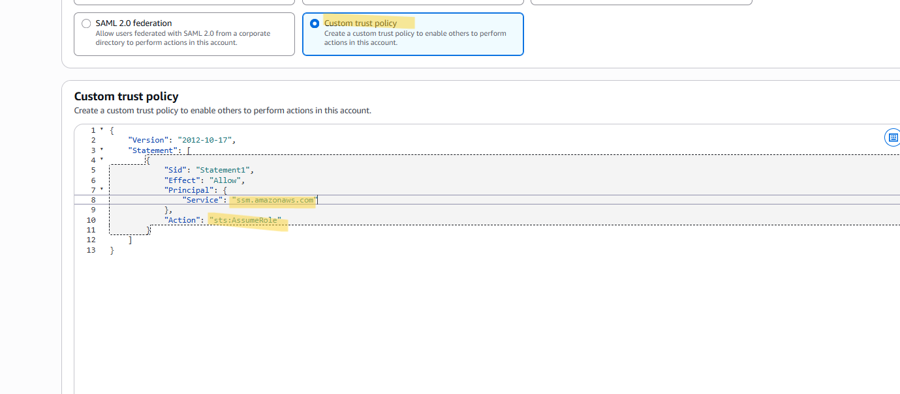
---

## Step 5 — Configure IAM Permissions

An inline permission policy was attached to the remediation role.

The policy provides the permissions required by the remediation workflow:

```json id="w8n3cz"
{
  "Version": "2012-10-17",
  "Statement": [
    {
      "Sid": "EbsEncryptionRemediation",
      "Effect": "Allow",
      "Action": [
        "ec2:EnableEbsEncryptionByDefault",
        "ec2:GetEbsEncryptionByDefault",
        "ssm:StartAutomationExecution",
        "ssm:GetAutomationExecution"
      ],
      "Resource": "*"
    }
  ]
}
```

The role was intentionally created separately from the EventBridge execution role because the two roles serve different purposes.

```text id="3p6v2a"
EventBridge Role
      ↓
sns:Publish
      ↓
SNS Topic

SSM Automation Role
      ↓
EBS Remediation
      ↓
EC2 / SSM APIs
```

This separation follows the principle of **least privilege and role separation**.

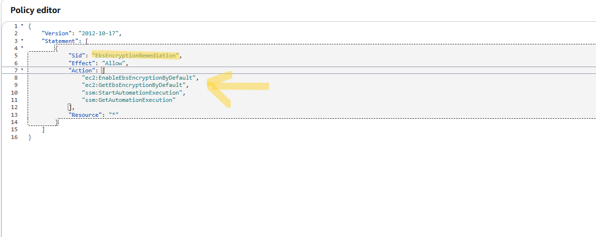
---

## Step 6 — Configure AutomationAssumeRole

Return to the AWS Config remediation configuration.

Provide the ARN of:

```text id="c0f7nx"
Auto-remediation-role
```

Example:

```text
arn:aws:iam::<ACCOUNT-ID>:role/Auto-remediation-role
```

The ARN is used as the `AutomationAssumeRole` parameter for the Systems Manager Automation runbook.

After configuring the role, save the remediation settings.

---

## Step 7 — Verify the Remediation Configuration

The AWS Config rule should now show an automatic remediation action associated with it.

Expected configuration:

```text id="7n3c6f"
Rule:
ec2-ebs-encryption-by-default

Remediation:
AWSConfigRemediation-EnableEbsEncryptionByDefault

Mode:
Automatic

AutomationAssumeRole:
Auto-remediation-role
```

The rule was initially left in a `COMPLIANT` state before testing.

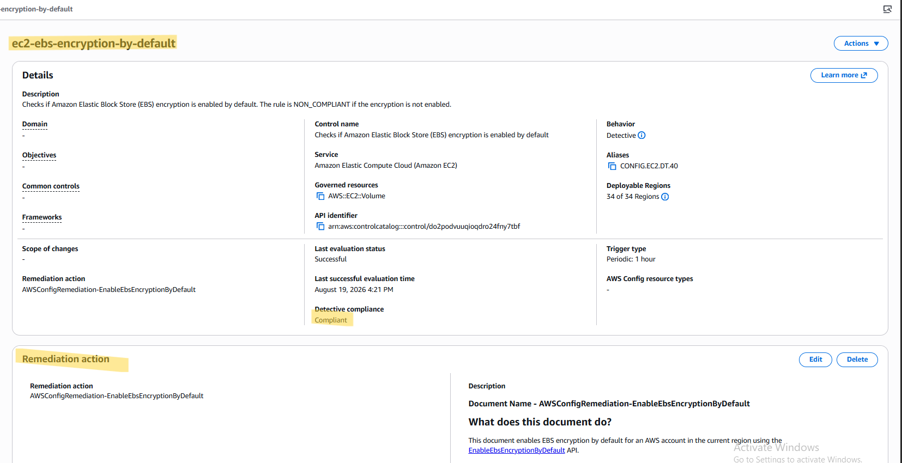
---

## Step 8 — Create a Test Violation

To test automated remediation, temporarily disable:

**EC2 → Settings → EBS encryption**

Set:

```text id="w4m7q1"
Always encrypt new EBS volumes
        ↓
      Disabled
```

This intentionally recreates the security violation.


---

## Step 9 — Trigger AWS Config Evaluation

Return to:

**AWS Config → Rules → `ec2-ebs-encryption-by-default`**

Select:

**Actions → Re-evaluate**

The rule detects the configuration as:

```text id="b4n6kt"
NON_COMPLIANT ❌
```

This state triggers the configured automatic remediation action.

---

## Step 10 — Verify Automatic Remediation

AWS Config automatically invokes:

```text id="j6x2mc"
AWSConfigRemediation-EnableEbsEncryptionByDefault
```

The automation enables EBS encryption by default without manually changing the setting.

The resulting state becomes:

```text id="m2v9ka"
EBS Encryption by Default
        ↓
      Enabled
```

AWS Config then reports:

```text id="f5r8zy"
COMPLIANT ✅
```

The important validation is that the configuration returned to `Enabled` **without manual intervention after the violation was created**.  
This is the strongest evidence that the remediation worked.

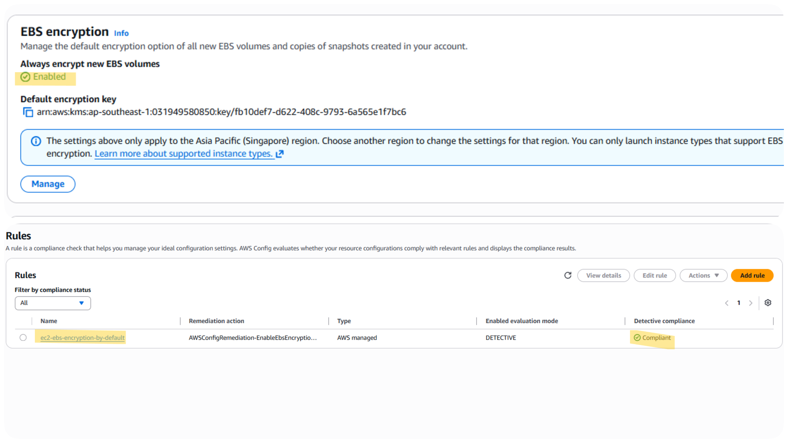
---

## Remediation Workflow

The completed remediation flow is:

```text id="9q4w2h"
EBS Encryption by Default
        ↓
      Disabled
        ↓
AWS Config
        ↓
   NON_COMPLIANT
        ↓
Automatic Remediation
        ↓
SSM Automation
        ↓
Enable EBS Encryption
        ↓
AWS Config Re-evaluation
        ↓
    COMPLIANT ✅
```

---

## Phase 6 Result

Automatic remediation was successfully implemented and tested.

The project demonstrated that AWS Config can move beyond detection and notification by automatically invoking an SSM Automation runbook to restore the required security configuration.

The final security state was:

```text id="e7s4mx"
EBS Encryption by Default = Enabled
AWS Config = COMPLIANT
```

The remediation was validated without manually enabling EBS encryption after the test violation.

This completed the **automated response layer** of the project.

> ## Phase 7 — Validation & Troubleshooting

### Objective

Validate the complete security workflow and troubleshoot a simulated notification failure.

The final workflow should be able to:

```text id="l5w2q9"
Detect
  ↓
Notify
  ↓
Remediate
  ↓
Verify
```

A controlled IAM failure was introduced to determine whether the notification path could be isolated without affecting automated remediation.

---

## Step 1 — Verify the Final Secure State

Before starting the troubleshooting test, verify that the environment is in a secure state.

### EBS Encryption

Open:

**EC2 → Settings → EBS encryption**

Verify:

```text id="m7d3s1"
Always encrypt new EBS volumes
        ↓
      Enabled ✅
```

### AWS Config

Open:

**AWS Config → Rules**

Verify:

```text id="r8k2v5"
ec2-ebs-encryption-by-default
        ↓
      COMPLIANT ✅
```

This establishes the baseline before introducing the controlled failure.


---

## Step 2 — Introduce a Controlled IAM Failure

To test troubleshooting, temporarily modify the EventBridge execution role:

```text id="6q4j9x"
Sns-topic-for-eventbridge
```

The original permission was:

```json id="j8x4s2"
{
  "Effect": "Allow",
  "Action": "sns:Publish",
  "Resource": "arn:aws:sns:ap-southeast-1:<ACCOUNT-ID>:cloud-security-alerts"
}
```

For the test, an explicit `Deny` was introduced:

```json id="k3v7p1"
{
  "Version": "2012-10-17",
  "Statement": [
    {
      "Sid": "DenySnsPublishForTest",
      "Effect": "Deny",
      "Action": "sns:Publish",
      "Resource": "arn:aws:sns:ap-southeast-1:<ACCOUNT-ID>:cloud-security-alerts"
    }
  ]
}
```

The purpose of this change was to simulate a permission failure specifically on the **EventBridge → SNS** path.

The trust relationship and the rest of the security workflow were not changed.

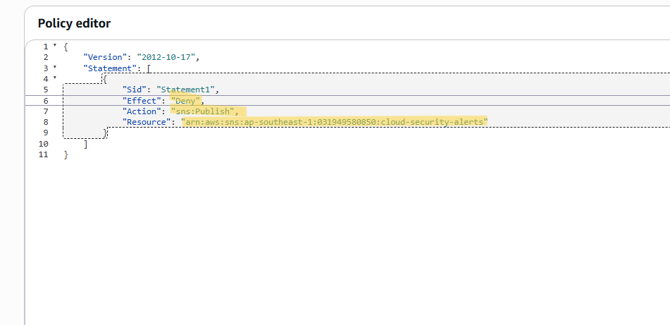
---

## Step 3 — Recreate the Security Violation

Temporarily disable:

**EC2 → Settings → EBS encryption**

Set:

```text id="f6q9t2"
Always encrypt new EBS volumes
        ↓
      Disabled
```

This recreates the security violation while the SNS permission failure is active.

---

## Step 4 — Trigger Config Evaluation

Return to:

**AWS Config → Rules → `ec2-ebs-encryption-by-default`**

Select:

**Actions → Re-evaluate**

AWS Config should report:

```text id="n5k1c8"
NON_COMPLIANT ❌
```

At this point, the security workflow is triggered.


---

## Step 5 — Observe the Different Workflow Paths

The system now processes the same compliance event through multiple paths:

```text id="u4r8m6"
AWS Config
    ↓
NON_COMPLIANT
    │
    ├──→ EventBridge
    │      ├──→ CloudWatch Logs ✅
    │      └──→ SNS ❌
    │
    └──→ Auto Remediation
             ↓
         SSM Automation ✅
```

The key observation was:

* AWS Config successfully detected the violation.
* Automatic remediation successfully restored EBS encryption.
* CloudWatch Logs continued to receive the event.
* The SNS notification was not delivered because `sns:Publish` was explicitly denied.

This isolates the failure to the notification path
and proves EventBridge successfully processed the event.


---

## Step 6 — Verify Automated Remediation Still Works

Check:

**EC2 → Settings → EBS encryption**

The setting should have returned automatically to:

```text id="d5v1w2"
Enabled ✅
```

AWS Config should also eventually show:

```text id="s9c4x6"
COMPLIANT ✅
```

This demonstrates that the IAM failure in the SNS path did not break the remediation path.

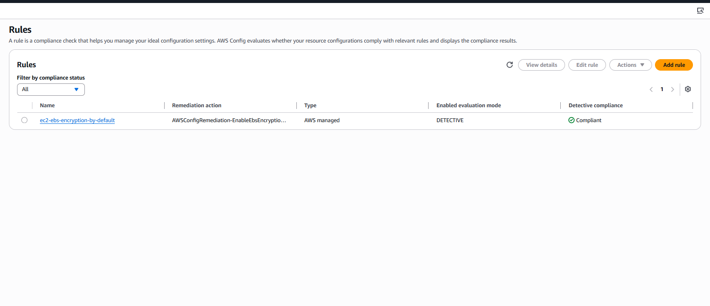
---

## Step 7 — Confirm Notification Failure

Check the subscribed email inbox.

No new SNS notification should be received for the test event.

This provides the final symptom:

```text id="e3q7m2"
CloudWatch Logs → Event received ✅
SNS Email       → No notification ❌
Remediation     → Successful ✅
```

The failure is therefore isolated to the **SNS publishing path**.


---

## Step 8 — Identify the Root Cause

The root cause was the explicit IAM `Deny` applied to:

```text id="c7n2v9"
sns:Publish
```

for the EventBridge execution role:

```text id="a2m6k8"
Sns-topic-for-eventbridge
```

The failure path was:

```text id="j4q8s1"
EventBridge
      ↓
Assume IAM Role
      ↓
sns:Publish
      ↓
Explicit Deny ❌
      ↓
SNS notification failure
```

This demonstrates the effect of an IAM explicit deny: the permission is denied even when an `Allow` would otherwise exist.

---

## Step 9 — Restore the Original IAM Permission

Remove the temporary `Deny` statement.

Restore the least-privilege permission:

```json id="p2r6w4"
{
  "Version": "2012-10-17",
  "Statement": [
    {
      "Sid": "AllowSnsPublish",
      "Effect": "Allow",
      "Action": "sns:Publish",
      "Resource": "arn:aws:sns:ap-southeast-1:<ACCOUNT-ID>:cloud-security-alerts"
    }
  ]
}
```

The EventBridge execution role is once again restricted to publishing only to the required SNS topic.

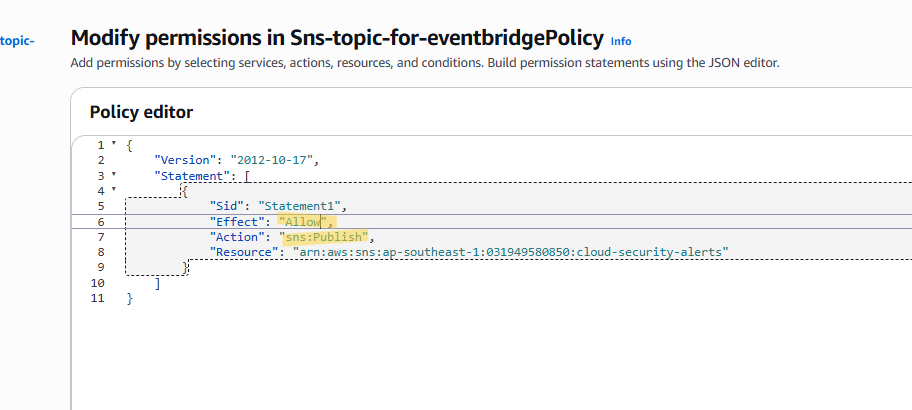
---

## Step 10 — Final Validation

Verify the final environment:

### EBS Encryption

```text id="x6j3v8"
Enabled ✅
```

### AWS Config

```text id="y4p7k2"
COMPLIANT ✅
```

### IAM

```text id="z1n5m9"
sns:Publish
        ↓
cloud-security-alerts
```

The environment is restored to its intended secure configuration.


---

## Troubleshooting Summary

### Symptom

The AWS Config rule became `NON_COMPLIANT`, but no SNS email notification was received.

### Investigation

```text id="t6k2w8"
AWS Config
       ✅
       ↓
EventBridge
       ✅
       ↓
CloudWatch Logs
       ✅
       ↓
SNS
       ❌
```

At the same time:

```text id="r9m3c5"
Auto Remediation
       ↓
SSM Automation
       ↓
EBS Encryption Enabled ✅
```

### Root Cause

An explicit IAM `Deny` prevented the EventBridge execution role from performing:

```text
sns:Publish
```

on the `cloud-security-alerts` SNS topic.

### Resolution

The temporary `Deny` statement was removed and the original least-privilege `Allow` policy was restored.

---

> ## Phase 7 Result

The final validation confirmed that the complete security workflow operates as intended:

```text id="v5c8q2"
NON_COMPLIANT
      ↓
AWS Config
      ↓
EventBridge
   ↙       ↘
Logs       SNS
            ↓
          Email
      ↓
Auto Remediation
      ↓
SSM Automation
      ↓
COMPLIANT ✅
```

The troubleshooting exercise also demonstrated that a failure in one branch of the workflow does not necessarily break the others.

The notification failure was successfully isolated to the **EventBridge → SNS IAM authorization path**, while detection, logging, and automated remediation continued to operate.

The environment was restored to its final secure state:

```text id="w3n7f1"
EBS Encryption by Default = Enabled
AWS Config = COMPLIANT
SNS IAM Permission = Restored
```

## Conclusion

This project demonstrated how multiple AWS security services can be integrated into an automated compliance workflow.

The final architecture implements:

```text id="7p4m2x"
Detect
  ↓
AWS Config
  ↓
Route
  ↓
EventBridge
  ↓
Log + Notify
  ↙       ↘
Logs      SNS
            ↓
          Email
  ↓
Remediate
  ↓
SSM Automation
  ↓
Verify
  ↓
COMPLIANT
```

### Project Outcome

The project progressed from simple configuration monitoring to an automated security control:

**Detect → Notify → Remediate → Verify**

This represents the transition from learning individual AWS security services to designing an integrated Cloud Security solution.

## Delete ⬇️
```
1. Delete Config Auto Remediation
2. Delete Config Rule
3. Delete EventBridge Rule
4. Delete SNS Subscription
5. Delete SNS Topic
6. Delete CloudWatch Log Group
7. Delete IAM Roles
8. Terminate EC2
9. Check & delete orphaned EBS volume
```

## Project Complete ✅

